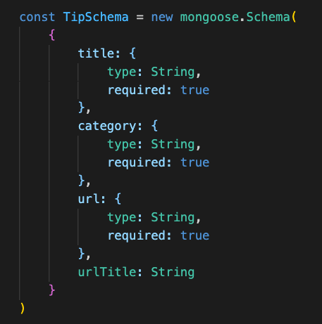

# Fruitbowl (Backend)

Welcome to the backend side of our Fruitbowl application! We wanted to create our own API to hold curated data for the purposes of this app, as finding a pre-built API didn't suit the needs of our users.

---
## Technologies Used:

- Node.js
- Express.js
- Mongoose
- MongoDB
- Heroku for deployment

---

## Simple Schema:

## Use and Contribution:

To find the frontend repo head [here](https://github.com/jdephil/fruit-bowl-frontend). For further use please fork and clone, followed by a pull request.
